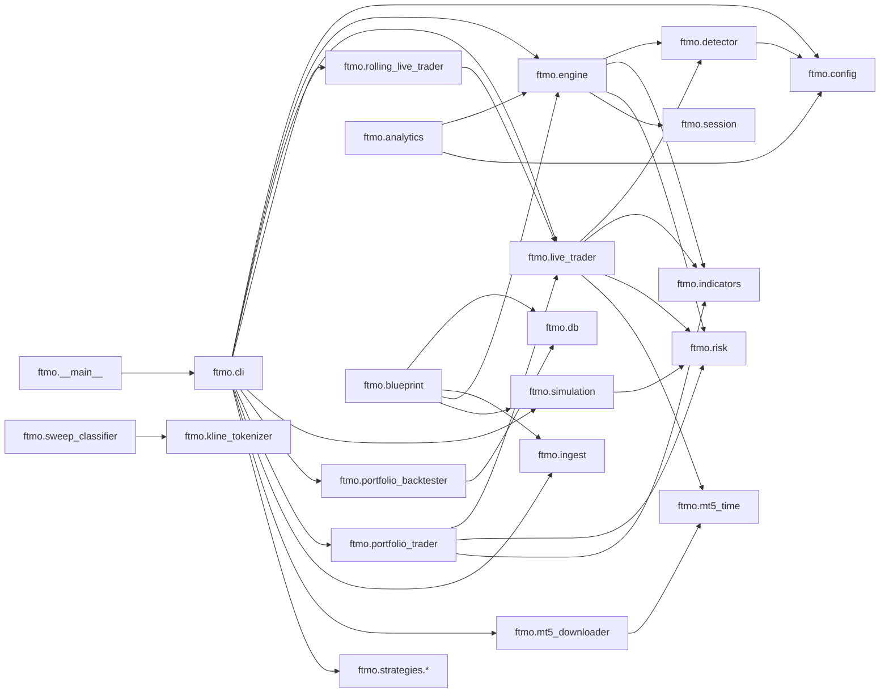

# FTMO Dependencies

## Internal Dependency Graph

## Direct External Dependencies
- `pandas`: market data, analytics, research, backtests, live cache handling
- `numpy`: indicators, classifiers, research math
- `duckdb`: FTMO trade and simulation persistence
- `requests`: ForexFactory calendar and HTTP fetches
- `flask`: dashboard blueprint
- `MetaTrader5`: live trading and historical download
- `pytz`: research timestamp handling
- `scikit-learn`: research and classifier pipeline
- `yfinance`: research-only data acquisition
- `pyzmq`, `websockets`, `protobuf`: platform-level messaging and runtime dependencies elsewhere in the repo, relevant to the broader trading system

## FTMO Runtime Artifacts
- `ftmo/ftmo_trading.db`
- `ftmo/cache_*.parquet`
- `ftmo/*_M5.csv`
- `ftmo/trade_log*.csv`
- `ftmo/sweep_clf*.pkl`
- `ftmo/sweep_labels*.pkl`
- `ftmo/kline_vocab*.pkl`
- `ftmo/.calendar_cache.json`

## Module Role Map
- `config.py`: canonical constants and instrument registry
- `risk.py`: FTMO limits, internal overlays, and lot sizing
- `detector.py`: sweep and structure-shift logic
- `engine.py`: deterministic backtest engine
- `simulation.py`: rolling FTMO challenge simulation
- `live_trader.py`: primary MT5 live execution engine
- `rolling_live_trader.py`: alternative rolling-range live engine
- `portfolio_trader.py`: multi-symbol live coordination
- `db.py`: DuckDB schema and CRUD helpers
- `blueprint.py`: Flask API and dashboard surface
- `research/*`: exploratory analysis and feature generation
- `strategies/*`: reusable strategy implementations for portfolio and live orchestration

## Takeaway
The package has a healthy dependency shape: core logic depends downward into config, risk, indicators, and persistence; orchestration layers depend on those lower layers; research stays adjacent rather than entangled with the live path.
