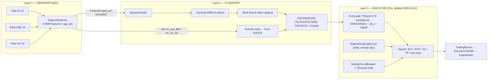
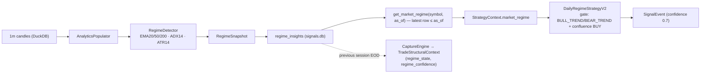

# DRA Technical Dossier — Daily Regime Analyzer (as-built, v1.x)

**Date:** 2026-07-02
**Author role:** Project historian (evidence preparation for an independent architecture review board)
**Purpose:** Faithful description of the existing Daily Regime Analyzer prior to the DRA 2.0 design effort. This document describes; it does not evaluate, critique, or propose.
**Primary evidence base:** `D:\BOT\root` (pre-SALVAGE monolith, where all DRA code lives) and `F:\nifty` (current platform repo, where DRA governance/removal decisions are recorded).

> **Naming note.** No component in either repository is literally named "Daily Regime Analyzer" or "DRA". The name maps onto the **daily market-regime classification subsystem** of the pre-SALVAGE monolith, which exists in two distinct generations plus adjacent look-alikes:
>
> 1. **Rule-based analytics regime engine** — `RegimeDetector` (`core/analytics/regime_engine.py`), persisted to `regime_insights`, consumed via `StrategyContext.market_regime` by `DailyRegimeStrategyV2` (`core/strategies/daily_regime_strategy_v2.py`).
> 2. **HMM Regime Classification system** (Feb 2026) — the substantive research artifact: `RegimeObserver` → `HMMRegimeClassifier` → executor pipeline (`core/strategies/regime/`), documented in `docs/HMM_REGIME_STRATEGY_REPORT.md`.
>
> Adjacent systems that use the word "regime" but are **not** the DRA (documented in §10.6 to prevent reviewer confusion): the DayType classifier ("13:00 regime"), the NiftyShield `regime_sizing` config (keyed on DayType classes), the options-oriented `VolatilityRegime` classifier, and the options dashboard's "GEX regime" label.

---

## 1. Executive Summary

**Original purpose.** Classify each trading day of the Indian market (Nifty 50 universe) into a small set of regimes — trending vs. ranging (rule-based generation) and Expansion / Contraction / Shock (HMM generation) — so that trading strategies could be *gated* by market state: trade only in favorable regimes, exit or de-risk in hostile ones, and size positions by classification confidence.

**Problem it solves.** The project's per-symbol alpha research (PixityAI swing/reversion) had failed at scale: a Phase 6 walk-forward scan found only **4 of 196 equity symbols** passed all profitability criteria. The regime hypothesis reframed the problem from "which symbol has edge" to "when does the market permit trading at all."

**Evolution.**

| Period | Event | Evidence |
|---|---|---|
| ≤ Feb 2026 | Rule-based `RegimeDetector` (EMA/ADX/ATR) exists in the recovered baseline; writes `regime_insights`; `DailyRegimeStrategyV2` gates on it | commit `123899c` (2026-02-01); `core/analytics/regime_engine.py` |
| Jan 2026 | `daily_regime_v2` paper backfill runs on CDSL (19 signals, 11 trades) | `backfills/daily_regime_v2/CDSL/…` |
| Feb 2026 | HMM Regime Strategy built and walk-forward backtested (9 windows, 2023–2026). Verdict: **classifier works, strategy not profitable on Nifty cash index** | `docs/HMM_REGIME_STRATEGY_REPORT.md` |
| 2026-03-01 | Execution layer of the HMM system (executor, sizing, circuit breaker, config) archived during the pivot to NiftyShield premium selling; **archive contents subsequently lost** (directory now empty) | commit `ea803b0`; `core/strategies/regime/__init__.py` docstring |
| 2026-06-04 | SALVAGE migration to `F:\nifty` **drops** all strategies, indicators, `regime_engine.py`, `regime/`, `daily_regime_strategy_v2.py`, and the HMM report by explicit user decision | `docs/reports/SALVAGE_REPORT.md` §4 |
| 2026-07-01/02 | MM11 removes the last dead residue from the platform: `CaptureEngine`/TLP (ADR-015), `regime_insights`/`regime_snapshots` DDL (MM11.4), dead `AnalyticsQuery` (MM11.7). Platform v1.0 certified strategy-agnostic | `docs/ARCHITECTURE_DECISIONS.md` ADR-015; `docs/CHANGELOG_PLATFORM.md` |

**Current status.** The DRA does **not exist in the current platform repo** (`F:\nifty`). Its code survives in `D:\BOT\root` (observer, classifier, rule-based engine, strategy shell, tests, backtest results, a validated regime map, and the daily intermarket data). The current platform retains only two passive audit fields (`TradeStructuralContext.regime_state` / `regime_confidence` in `core/events.py` and the `trade_context` table DDL) and the intermarket data-ingest script (`scripts/fetch_intermarket_data.py`, now serving the DayType Block H features). Per `docs/PLATFORM_CONSTITUTION.md`, market-regime research is out of platform scope and any future strategy (including a DRA 2.0) integrates through the MM12 Strategy Integration Contract (`SignalSource`).

---

## 2. Original Research Motivation

From `docs/HMM_REGIME_STRATEGY_REPORT.md` §1, `docs/STRATEGY_RESEARCH_LOG.md`, and `docs/NIFTYSHIELD_IMPLEMENTATION.md` §1:

**Why DRA was created.** After the Phase 6 walk-forward scan showed only 4/196 equity symbols passing all profitability criteria under the PixityAI swing/reversion strategy, the project pivoted from **per-symbol alpha** to **market regime detection**: classify daily market conditions with a Hidden Markov Model and gate intraday trades accordingly.

**Weaknesses in prior approaches it targeted** (documented in the Strategy Research Log's "Consistent Problems Across All Versions"):

- **No regime filter on momentum** — strategy versions v5/v6 took longs regardless of Nifty direction; long-only books suffered simultaneously in the 2025 H2 chop with no hedge.
- **Parameter non-stationarity** — fixed lookbacks (20-day momentum, 14-period ATR) did not adapt to regime changes.
- Binary regime gates were too blunt: the v7 Nifty-200DMA gate "blocks ALL trades in bear/chop regime → zero trades" — motivating a probabilistic, multi-state classification rather than a single threshold.
- Per-symbol prediction had exhausted itself (4/196 pass rate); "the edge didn't disappear — the regime changed" became the recurring diagnosis (`docs/Claudereasearch-12052026.md`).

**Hypotheses tested** (report §1):

1. Markets alternate between **expansion** (trending, low volatility), **contraction** (range-bound), and **shock** (high volatility, dislocations) regimes.
2. These regimes are identifiable **causally** from daily intermarket signals (India VIX, Bank Nifty/Nifty ratio, Nifty trend slope, realized volatility).
3. Given the regime, a system can (a) trade only during expansion, (b) exit/reduce during shock or contraction, and (c) size positions by regime confidence (entropy).
4. A probabilistic HMM adds value over a naive VIX-threshold baseline (tested head-to-head, §8 below).

---

## 3. Mathematical Formulation

### 3.1 Generation 1 — Rule-based `RegimeDetector` (`core/analytics/regime_engine.py`)

Deterministic threshold classifier on the last bar of an OHLCV frame (minimum 50 bars, else returns `None`). Indicators: EMA(20), EMA(50), EMA(200), ADX(14), ATR(14) from `core/analytics/indicators/`.

Definitions (last close `C`, fast/medium EMAs `F`, `M`, ADX value `A`, ATR value `T`):

```
trend_strength = min(A / 50, 1.0)                    # normalized ADX ∈ [0,1]
atr_pct        = 100 · T / C
volatility_level: LOW (<0.5) | MEDIUM (<1.5) | HIGH (<3.0) | EXTREME (≥3.0)

is_bullish = C > F > M         is_bearish = C < F < M

regime:
  is_bullish ∧ A > 22  → BULL_TREND        is_bullish ∧ A ≤ 22 → BULLISH_CONSOLIDATION
  is_bearish ∧ A > 22  → BEAR_TREND        is_bearish ∧ A ≤ 22 → BEARISH_CONSOLIDATION
  A < 20 (overrides above) → VOLATILE_RANGE if volatility_level ∈ {HIGH, EXTREME} else RANGING
momentum_bias: BULLISH | BEARISH | NEUTRAL   (from is_bullish / is_bearish)
persistence_score = 0.8       # hardcoded placeholder ("Placeholder for further logic")
```

Output is an immutable `RegimeSnapshot` dataclass (insight_id, symbol, timestamp, regime, momentum_bias, trend_strength, volatility_level, persistence_score, ma_fast/medium/slow).

### 3.2 Generation 2 — Gaussian HMM (`core/strategies/regime/classifier.py`)

**Model.** A first-order hidden Markov model with `K = 3` hidden states and multivariate Gaussian emissions over `d = 6` standardized daily features:

- Hidden state sequence: `S_1, …, S_T ∈ {0, …, K−1}` with initial distribution `π` and transition matrix `A`, `A_ij = P(S_{t+1}=j | S_t=i)`.
- Emissions: `X_t | S_t = k ~ N(μ_k, Σ_k)` with **full covariance** `Σ_k` (automatic fallback to **diagonal** covariance if the full-covariance fit raises `ValueError`).
- Feature standardization before fit and predict: `x' = (x − μ_train) / σ_train` via `sklearn.StandardScaler` fit on the training window only.

**Training.** `hmmlearn.hmm.GaussianHMM` fit by EM (Baum-Welch): `n_components=3`, `n_iter=200`, `tol=1e-4`, `random_state=42` (reproducibility). Re-fit from scratch on each walk-forward training window.

**Inference.** Per-day smoothed posteriors from the forward-backward algorithm (`model.score_samples`):

```
γ_t(k) = P(S_t = k | X_1:T)          # posterior state probability
```

reported as `P(EXPANSION)`, `P(CONTRACTION)`, `P(SHOCK)` after semantic mapping, with per-day Shannon entropy:

```
H_t = − Σ_k γ_t(k) · ln(γ_t(k) + ε),   ε = 1e-10
```

High entropy = uncertain classification. (Empirically, mean entropy ≈ 0.00002 — see §8.4.)

**Semantic state mapping — rank-based scoring** (adopted "per expert review" over fragile position-based mapping; report §3.2). Let `means[k, f]` be fitted emission means; `rank(v)` = double-argsort rank (0 = lowest):

```
vix_rank   = rank over states of mean vix_level
vol_rank   = rank over states of mean realized_vol_10d
slope_rank = rank over states of mean nifty_20dma_slope

shock_score[k]     = vix_rank[k] + vol_rank[k]                 # high VIX + high vol
expansion_score[k] = (K−1 − vix_rank[k]) + slope_rank[k]       # low VIX + positive slope

SHOCK       = argmax_k shock_score
EXPANSION   = argmax_{k ≠ SHOCK} expansion_score
CONTRACTION = the remaining state
```

**Override rules** (rule layer above the HMM, evaluated on *raw unscaled* features; produce probability 1.0, entropy 0.0, `is_override=True`):

```
vix_roc_5d   > 0.20  → force SHOCK    (VIX spike >20% in 5 days)
vix_pctl_90d > 0.85  → force SHOCK    (VIX at extreme percentile)
```

**Output.** `RegimeClassification(date, state, probabilities: {EXPANSION, CONTRACTION, SHOCK}, entropy, is_override)`. Model, scaler, and state map are serialized together via `joblib`.

### 3.3 Execution-layer mathematics (source deleted; preserved in `HMM_REGIME_STRATEGY_REPORT.md` §3.3–3.5)

Executor (`executor.py`, 354 lines, deleted 2026-03-01):

```
ENTRY (all must hold):
  P(Expansion) > 0.70 for ≥ persistence_days consecutive calendar days (final value: 1)
  EMA(9) > EMA(21) on 15m bars
  vol_z > 1.0            (bypassed when instrument volume ≡ 0)
  close > session VWAP   (bypassed when instrument volume ≡ 0)
  no open position

EXIT (any triggers):
  P(Shock) > 0.65   |   P(Contraction) > 0.65
  SL: entry − 1.5·ATR    TP: entry + 2.0·ATR    time stop: 20 × 15m bars (5h)
```

Sizing (`RegimeRiskEngine`, volatility parity):

```
risk_amount   = capital × 0.75%
position_size = risk_amount / (2 · ATR)
SL = entry ∓ 1.5·ATR      TP = entry ± 2.0·ATR
entropy adjustment: if regime entropy > 0.5 → halve position size
guardrails: max notional = 2× capital; minimum quantity = 1
```

Circuit breaker (`WeeklyCircuitBreaker`): equity baseline resets each Monday; halt all trading if weekly drawdown > 3%.

VIX baseline (comparison arm): entry `VIX < 18.0 ∧ EMA(9) > EMA(21)`; exit `VIX > 22.0`; identical sizing/SL/TP/time-stop.

### 3.4 `DailyRegimeStrategyV2` gate (`core/strategies/daily_regime_strategy_v2.py`)

Pure gating logic, no math: emit `SignalEvent(BUY, confidence=0.7)` iff `context.market_regime["regime"] ∈ {BULL_TREND, BEAR_TREND}` **and** the confluence analytics snapshot's signal is `BUY`; otherwise emit nothing.

### 3.5 Assumptions (as documented)

- Gaussian emissions and first-order Markov dynamics over daily features; distribution stationarity within each 9-month training window.
- All features use **only trailing (causal) windows — no look-ahead bias** (report §3.1).
- Feature scale sensitivity handled by standardization ("HMM is sensitive to scale", classifier docstring).
- Daily frequency for regime state; the regime for intraday consumption is the **previous session's EOD state** (`CaptureEngine._get_previous_regime`).

---

## 4. Feature Engineering

### 4.1 HMM input features (6) — `RegimeObserver.compute_features()`

All computed from daily closes of Nifty 50, Bank Nifty, and India VIX, aligned on common dates (`dropna` after alignment), date-indexed, last value kept per day. Window parameters are configurable via the observer config dict; defaults below.

| # | Feature | Formula | Intuition / why selected | Lookback | Normalization / preprocessing | Dependencies |
|---|---|---|---|---|---|---|
| 1 | `vix_level` | India VIX close | Absolute fear gauge; core regime discriminator | 1 day | StandardScaler (train window) | India VIX 1d candles |
| 2 | `vix_pctl_90d` | rolling 90d percentile of VIX close: `(x_t ≥ window).sum() / len(window)` | Scale-free "how extreme is VIX now vs. recent history"; also drives the SHOCK override | 90 days (`min_periods=30`) | Already ∈ [0,1]; StandardScaler applied anyway | VIX series |
| 3 | `vix_roc_5d` | `(VIX_t − VIX_{t−5}) / VIX_{t−5}` | Sudden-spike detection (shock onset); drives the SHOCK override | 5 days | StandardScaler | VIX series |
| 4 | `banknifty_nifty_ratio` | `BN_close / NF_close` | Financial-sector leadership as an intermarket regime signal | 1 day | StandardScaler | Bank Nifty + Nifty 1d candles |
| 5 | `nifty_20dma_slope` | `EMA20(NF_close)_t − EMA20(NF_close)_{t−5}` (EMA span 20, `adjust=False`) | Direction and steepness of the primary trend | 20d EMA, 5d delta | StandardScaler | Nifty series |
| 6 | `realized_vol_10d` | rolling 10d stdev of `ln(NF_t / NF_{t−1})` (`min_periods=5`) | Realized (as opposed to implied) volatility level | 10 days | StandardScaler | Nifty series |

### 4.2 Execution-filter feature (computed, deliberately excluded from the HMM)

| Feature | Formula | Status |
|---|---|---|
| `gap_pct` | `(NF_open_t − NF_close_{t−1}) / NF_close_{t−1}` | Computed by the Observer but **excluded from HMM inputs "per expert review"** — classified as an execution-level filter, not a regime indicator (report §3.1) |

### 4.3 Removed / never-implemented feature

| Feature | Reason removed | Evidence |
|---|---|---|
| **USDINR slope** (planned 7th HMM feature) | Instrument unavailable via Upstox — 5 instrument-key variants tried, all returned HTTP 400. System proceeded with 6 features instead of the planned 7. | report §4.1; observer docstring |

### 4.4 Executor-level (intraday, 15m) features — source deleted, documented in report

- EMA(9) and EMA(21) on 15m bars (trend alignment; originally a *fresh crossover within 3 bars* requirement, relaxed to simple alignment — bug 7.5).
- `vol_z` (volume z-score > 1.0) and session VWAP — both **auto-bypassed** when `df['volume'].sum() == 0` (Nifty index case; bug 7.2). VWAP computed as `(close·volume).groupby(date).cumsum() / volume.groupby(date).cumsum()` after the groupby-apply misalignment fix (bug 7.4).
- ATR (for SL/TP/sizing).
- Persistence counter: consecutive-expansion-day count precomputed **per calendar date**, not per bar (bug 7.3).

### 4.5 Generation-1 features (`RegimeDetector`)

EMA(20), EMA(50), EMA(200), ADX(14), ATR(14), `atr_pct = ATR/close·100` — thresholds in §3.1. No normalization; raw indicator values. Requires ≥ 50 bars.

---

## 5. Dataset

**Instruments (daily features):**

| Instrument | Upstox key | Candles |
|---|---|---|
| Nifty 50 | `NSE_INDEX\|Nifty 50` | 775 (Jan 2023 – Feb 2026) |
| Bank Nifty | `NSE_INDEX\|Nifty Bank` | 775 |
| India VIX | `NSE_INDEX\|India VIX` | 775 |

- **Source:** Upstox V3 API via `scripts/fetch_intermarket_data.py` (exists in both repos; the F:\nifty copy now also backfills 1m Bank Nifty for DayType Block H).
- **Storage:** `data/market_data/nse/candles/1d/{YYYY-MM-DD}.duckdb` — one DuckDB file per day, same layout as the 1m store.
- **Execution data:** 15m bars resampled from stored 1m candles, with a **30-day warmup** before each test window for EMA/ATR computation.
- **Effective backtest range:** May 2023 – Feb 2026 (~2.7 years) after feature warmup.

**Train / validation / test structure.** No static split; a **rolling walk-forward** design (`scripts/run_regime_backtest.py`, deleted): 9 windows, 9-month train / 3-month test / 3-month step. The HMM is re-fit per window on training features only; signals are generated on the test window and executed through `TradingRunner` + `PaperBroker`. There is no separate validation set and no hyperparameter search recorded (CLI switches existed for `--n_states` and `--train_months`; no results were recorded).

**Sampling frequency:** daily for features/classification; 15-minute for execution.

**Labels:** none — the HMM is unsupervised (§6).

**Missing data handling:**
- Cross-series alignment: inner-join on common dates, then `dropna()` (holiday mismatches between the three indices drop the day).
- Report §3.1 states "Missing data handled via forward-fill within each series."
- Rolling features use `min_periods` (30 for the 90d percentile, 5 for the 10d vol); leading NaNs dropped by the final `dropna()`.
- Duplicate same-day rows: last kept (`~index.duplicated(keep='last')`).

**Outlier handling:** none documented beyond StandardScaler standardization and the rule-based SHOCK overrides for extreme VIX values.

**Corporate action handling:** not documented. All three inputs are indices (no splits/dividends apply); no adjustment logic exists anywhere in the DRA code.

**Data cleaning:** limited to the alignment/dedup/dropna steps above; input frames are validated only for presence of `open`/`close` columns and a datetime index or `timestamp` column.

---

## 6. Target Labels

**The DRA has no ground-truth labels.** Regime definitions differ by generation:

**Generation 1 (rule-based):** regimes are **threshold-defined**, not learned: `BULL_TREND`, `BEAR_TREND`, `BULLISH_CONSOLIDATION`, `BEARISH_CONSOLIDATION`, `RANGING`, `VOLATILE_RANGE` (plus `UNKNOWN` as documented fallback in the snapshot docstring). Definitions are the deterministic EMA/ADX/ATR rules of §3.1. Class count follows directly from the 2×2 (direction × trend-strength) grid plus the two low-ADX range states.

**Generation 2 (HMM):** regimes are **cluster-based and unsupervised**:

- The Gaussian HMM discovers 3 latent states from the 6 daily features; no future information and no manual labeling is used in training.
- Semantic names (EXPANSION / CONTRACTION / SHOCK) are assigned **after** fitting by the rank-based scoring of emission means (§3.2) — i.e., the "labels" are a deterministic post-hoc interpretation of unsupervised states, not training targets.
- A rule-based override layer can force SHOCK regardless of the HMM (VIX RoC > 20% in 5d, or VIX 90d percentile > 0.85).
- **Why 3 classes:** the founding premise (report §1) — expansion / contraction / shock as the three economically distinct market modes. `n_states` was configurable (a 2-state CLI option existed for sensitivity analysis; report §10.3 lists 2/3/4-state comparison as *recommended, not performed*).
- The mapping was validated qualitatively: "3 states consistently mapped across all 9 windows … State transitions align with actual market events (Oct 2024 correction → SHOCK)" (report §8.1).

**Persisted label artifact:** `core/models/regime_map_validation.json` — a date → {EXPANSION|CONTRACTION} map covering 2025-06-02 to 2025-12-31 (149 trading days; no SHOCK days in this span). Its generator script and consumer are not documented (see §16).

---

## 7. Model

**Algorithm:** `hmmlearn.hmm.GaussianHMM` — 3-state Gaussian-emission hidden Markov model, wrapped by `HMMRegimeClassifier`.

**Hyperparameters (defaults in code; overridable via config dict):**

| Parameter | Value |
|---|---|
| `n_components` (states) | 3 |
| `covariance_type` | `full` (fallback: `diag` on `ValueError`) |
| `n_iter` | 200 |
| `tol` | 1e-4 |
| `random_state` | 42 |
| Feature scaling | `sklearn.StandardScaler`, fit on training window |
| Override thresholds | `vix_pctl > 0.85`, `vix_roc > 0.20` |

**Training pipeline (per walk-forward window):**
1. Load daily features for train + test range (Observer).
2. `StandardScaler.fit_transform` on training features.
3. `GaussianHMM.fit` (EM, 200 iters); on full-covariance failure, refit with diagonal covariance.
4. `_map_states()` — rank-based semantic assignment.
5. Classify test days (`predict_proba` / `classify_all` with raw-feature overrides).
6. Generate 15m execution signals; run through `TradingRunner` + `PaperBroker`; collect PnL/trades/win rate/max DD/Sharpe.

**Cross-validation:** none in the k-fold sense; the walk-forward itself is the out-of-sample protocol (9 sequential windows, sliding 3 months).

**Feature importance:** not computed; no such analysis exists in the repository.

**Calibration:** no calibration procedure was applied. The empirical probability behavior is documented instead: posteriors are near-degenerate (~100%/~0%), mean entropy ≈ 0.00002 (report §8.1–8.2).

**Probability outputs:** per-day `P(EXPANSION)`, `P(CONTRACTION)`, `P(SHOCK)` (forward-backward posteriors) + Shannon entropy + discrete argmax label + `is_override` flag.

**Persistence:** `joblib` bundle of `{model, scaler, state_map, n_states}` via `save()`/`load()`. No fitted HMM model file survives in either repo (only the PixityAI/sweep-classifier joblibs exist in `core/models/`).

**Generation-1 model:** not a learned model — deterministic indicator rules (§3.1); no hyperparameters beyond indicator periods (20/50/200 EMA, 14 ADX, 14 ATR) and the ADX 20/22 and ATR% 0.5/1.5/3.0 thresholds.

---

## 8. Validation

All quantitative validation lives in `docs/HMM_REGIME_STRATEGY_REPORT.md` §6–§8 and `data/regime_backtest_results.json`. **No accuracy / precision / recall / F1 / confusion matrix / ROC exists** — the classifier is unsupervised with no ground-truth labels; validation was economic (trading outcomes) and qualitative (event alignment).

### 8.1 HMM walk-forward (Nifty 50 cash index, 15m execution, PaperBroker)

| Window | Train | Test | Trades | PnL (Rs) | Win rate | Max DD | Sharpe | Regime dist. of trades | Converged |
|---|---|---|---|---|---|---|---|---|---|
| w1 | 2023-05→2024-02 (240d) | 2024-02→05 | 36 | +1,032.86 | 55.6% | 2.0% | 0.46 | EXP 18 / SHOCK 18 | ✔ |
| w2 | 2023-08→2024-05 (237d) | 2024-05→08 | 36 | −1,158.80 | 50.0% | 2.3% | −0.51 | EXP 18 / SHOCK 18 | ✔ |
| w3 | 2023-11→2024-08 (240d) | 2024-08→11 | 48 | −2,022.71 | 50.0% | 3.6% | −0.55 | EXP 24 / CONTR 22 / SHOCK 2 | ✔ |
| w4 | 2024-02→2024-11 (241d) | 2024-11→2025-02 | 4 | +242.34 | 50.0% | 0.6% | 2.08 | EXP 2 / SHOCK 1 / CONTR 1 | ✔ |
| w5 | 2024-05→2025-02 (243d) | 2025-02→05 | 42 | +1,828.18 | 57.1% | 2.6% | 0.45 | EXP 21 / CONTR 21 | ✔ |
| w6 | 2024-08→2025-05 (237d) | 2025-05→08 | 2 | −460.93 | 0.0% | 0.5% | 0.00 | EXP 1 | ✔ |
| w7 | 2024-11→2025-08 | 2025-08→11 | 0 | 0 | — | — | — | (none; `train_days: 0` in JSON) | ✔ |
| w8 | 2025-02→2025-11 (239d) | 2025-11→2026-02 | 32 | −1,107.99 | 50.0% | 1.8% | −0.73 | EXP 16 / CONTR 16 | ✔ |
| w9 | 2025-05→2026-02 | 2026-02→02-13 | 0 | 0 | — | — | — | (none; `train_days: 0` in JSON) | ✔ |
| **Total** | | | **200** | **−1,647** | **44.7%** | **3.6%** | **0.13** | | |

### 8.2 VIX-threshold baseline (same harness, fair-comparison sizing)

| Window | Trades | PnL (Rs) | Win rate | Max DD |
|---|---|---|---|---|
| w2 | 2 | −70 | 0.0% | 0.1% |
| w5 | 2 | +16 | 100.0% | 0.1% |
| others | 0 | 0 | — | — |
| **Total** | **4** | **−54** | **50.0%** | **0.1%** |

### 8.3 Head-to-head (report §6.3)

| Metric | HMM | VIX baseline | Report note |
|---|---|---|---|
| Total PnL | Rs −1,647 | Rs −54 | Neither profitable |
| Trades | 200 | 4 | VIX baseline nearly inactive |
| Avg win rate | 44.7% | 50.0% | HMM needs >50% at 1:2 R:R |
| Max drawdown | 3.6% | 0.1% | Both well-controlled |
| Active windows | 7/9 | 2/9 | HMM generates far more signals |

### 8.4 Confidence / calibration observations (report §8.1–8.2)

- Mean entropy ≈ **0.00002** — the HMM is "extremely confident"; posteriors are effectively one-hot.
- Consequence: the entropy-based position-size reduction (>0.5 → halve) "rarely triggered" in practice.
- The HMM **hard-switches states daily**; expansion days were scattered rather than consecutive, which killed the `persistence_days=2` gate (relaxed to 1).
- Qualitative validation: consistent 3-state mapping across all 9 windows; transitions align with real events (Oct 2024 correction → SHOCK); overrides "triggered appropriately during VIX spikes."

### 8.5 Other validation artifacts

- `core/models/regime_map_validation.json` — 149 days of daily labels (Jun–Dec 2025): a long EXPANSION run (Jun 2 – Jul 15), CONTRACTION Jul 16 – Sep 11, a brief EXPANSION Sep 12–22, then CONTRACTION through Dec 31. Provenance undocumented (§16).
- `backfills/daily_regime_v2/CDSL/…` — two Jan 2026 paper backfill runs of strategy `daily_regime_v2` on CDSL (2,250 bars, 2026-01-15→01-30, `analytics_source: stored_snapshots`, `min_confidence: 0.5`): run `0a6931…` produced 0 signals; run `280b1d…` produced 19 signals / 11 trades with signal metadata `{'regime': 'TRENDING_UP', 'momentum': 'BULLISH'}` — a regime vocabulary matching neither `RegimeDetector` nor the HMM (provenance undocumented, §16). Consecutive per-minute BUY signals in `signals.csv` show entry stacking (cf. the position-stacking guard later codified in `F:\nifty\CLAUDE.md` Backtesting Rules).
- Circuit breaker never triggered in backtests (report §3.5; drawdowns stayed within 3.6%).
- `tests/strategies/test_daily_regime_v2.py` exists but is a stub (constructs a context, then `pass` — no assertions). No unit tests exist for `RegimeObserver` or `HMMRegimeClassifier`.

---

## 9. Research Results

**Major findings** (report §8, §11):

1. **The classification layer works.** 3 states mapped consistently across all 9 walk-forward windows; transitions align with actual market events; overrides fire appropriately.
2. **The strategy built on it does not make money on the Nifty 50 cash index.** Total −Rs 1,647 over 200 trades, 44.7% win rate at 1:2 R:R (needs >50%).
3. **Root cause as diagnosed:** the execution layer, not the classifier — index instruments report volume=0 via Upstox, which silently disabled two of the three technical confirmation filters (vol_z, VWAP), leaving EMA-alignment-only entries with insufficient edge (report §8.3: "the primary reason the strategy is not profitable on index").

**Negative findings:**

- VIX-threshold baseline (entry VIX < 18) is **too conservative for Indian markets** (India VIX ranges 12–25); it produced 4 trades in 2.7 years. A meaningful threshold would be ~14–15.
- The persistence filter (≥2 consecutive expansion days) killed most signals because expansion days were scattered — a consequence of the hard-switching posterior behavior.
- Fresh EMA-crossover entry (within 3 bars) yielded 1 trade in 9 windows; in sustained expansions EMA(9) stays above EMA(21) for weeks with no crossover event.

**Unexpected findings:**

- Near-zero posterior entropy (~0.00002): the HMM never expresses uncertainty, so entropy-scaled sizing was inert.
- Nifty 50 (and index instruments generally) report volume=0 on Upstox — discovered as backtest bug 7.2 and later canonized as a platform-wide pitfall (`F:\nifty\CLAUDE.md`: "ALL NSE_INDEX symbols have volume=0 — never use VWAP or vol_z filters on index data").

**Successful ideas** (as documented): the 3-layer Observer→Classifier→Executor separation ("production-quality and reusable", report §11); rank-based state mapping; rule-based SHOCK overrides; causal-only features; walk-forward harness with a baseline comparison arm.

**Failed ideas** (as documented): HMM as a *standalone* index trading strategy; VIX < 18 baseline; crossover-event entries; per-bar persistence counting; entropy-scaled sizing (never triggered); five USDINR instrument-key variants.

**Research conclusions** (report §10–11 and `F:\nifty\docs/lessons_learned/regime_and_signal_quality.md`):

- "The HMM adds value as a regime classifier but not as a standalone trading strategy on Nifty 50 index. It should be repurposed as a **market-timing filter** for existing profitable strategies."
- Recommended (never executed): gate the 4 profitable PixityAI equity symbols (VEDL, BDL, KALYANKJIL, PNBHOUSING) by expansion regime; or gate Nifty futures/options structures by regime.
- Lessons-learned distillation: "Use regime state to decide **when** to trade. Use symbol-level alpha to decide **what** to trade. … Treat model confidence as a control signal, not as proof of edge."
- In practice the project pivoted to NiftyShield premium selling (Mar 2026), using the **DayType** classifier — not the HMM — as its regime input; the HMM execution layer was archived in the same commit.

---

## 10. Architectural Integration

All integration described here is **historical** (`D:\BOT\root`); §10.5 covers the current platform.

### 10.1 Legacy analytics path (Generation 1, per-bar)

```
scripts/update_analytics.py (entry; body is a mock stub)
  └─ AnalyticsPopulator (core/analytics/populator.py)
       ├─ ConfluenceEngine → confluence_insights
       └─ RegimeDetector.detect() → RegimeSnapshot
            └─ legacy_adapter.save_regime_snapshot() → AnalyticsWriter
                 └─ INSERT INTO regime_insights (SQLite signals.db, upsert on symbol+timestamp)
TradingRunner._on_bar (core/runner.py:251)
  └─ analytics.get_market_regime(symbol, as_of=bar.timestamp)      # causal: timestamp <= as_of, latest row
       └─ StrategyContext(market_regime=…) → strategy.process_bar()
            └─ DailyRegimeStrategyV2: gate on regime ∈ {BULL_TREND, BEAR_TREND} + confluence BUY
```

- **Inputs:** 1m OHLCV candles from DuckDB (2-day window for live updates).
- **Outputs:** `regime_insights` rows; gated `SignalEvent`s.
- **Provider stack:** `MarketDataQuery.get_market_regime` (SQLite, latest-row-≤-as_of); `PreloadedAnalyticsProvider` (preloads one regime per symbol); `CachedAnalyticsProvider` (LRU `_regime_cache`); `LiveAnalyticsProvider.get_market_regime` returns a **hardcoded placeholder** `{"regime": "TRENDING", momentum_bias NEUTRAL, trend_strength 0.5, volatility_level NORMAL, persistence_score 0.5}`.
- **Notable asymmetry:** the populator's backfill path (`_backfill_symbol`) computes only confluence insights in bulk — regime snapshots are written only by the live `_update_symbol` path.
- A twin table `regime_snapshots` was defined in `schema.py` with identical columns; only `regime_insights` had a writer.

### 10.2 HMM batch path (Generation 2, daily + backtest)

```
scripts/fetch_intermarket_data.py → data/market_data/nse/candles/1d/*.duckdb   (Nifty, BankNifty, India VIX)
scripts/run_regime_backtest.py (deleted)
  ├─ RegimeObserver.compute_features()  → 6 HMM features + gap_pct
  ├─ HMMRegimeClassifier.fit(train) → classify_all(test, raw_features)  [overrides applied]
  ├─ executor.batch_generate_regime_signals()  → 15m gated signals      (deleted)
  └─ TradingRunner + PaperBroker → data/regime_backtest_results.json
```

- **Execution timing:** features are EOD-daily; regime for day *t* uses data through day *t*; intraday consumers used the **previous session's** finalized state.
- **Replay behavior:** fully re-runnable batch — `random_state=42`, deterministic rank mapping, deterministic overrides; the walk-forward harness re-fits per window from stored candles.

### 10.3 Trade Learning Protocol capture path (consumer)

```
ExecutionHandler.process_signal (if capture_engine wired — it never was at any live composition root)
  └─ CaptureEngine.capture_context()
       ├─ _get_previous_regime(): SELECT regime, persistence_score FROM regime_insights
       │    WHERE timestamp < signal-date ORDER BY timestamp DESC LIMIT 1   → ("UNKNOWN", 0.0) on any failure
       └─ TradeStructuralContext(regime_state, regime_confidence, …)
            └─ writers.py → trade_context table (regime_state TEXT, regime_confidence REAL)
TLPLogger.record(regime=…) → tlp_trade_log (trading.db)
core/post_trade/trade_truth_model.py: regime_at_entry field
```

ADR-015 (2026-07-02) established that in the platform repo this path was **dead end-to-end**: `regime_insights` had zero live writers, both reads fell through `except: pass` to defaults, and `CaptureEngine` was never constructed at the sole composition root.

### 10.4 Dependencies and runtime requirements

- Python: `hmmlearn`, `scikit-learn` (StandardScaler), `joblib`, `pandas`, `numpy`; Generation 1 additionally the in-repo indicator classes (EMA/ADX/ATR).
- Storage: DuckDB (candles), SQLite `signals.db` (`regime_insights`), SQLite `trading.db` (`tlp_trade_log`), JSON artifacts.
- Determinism guarantees as documented: fixed `random_state=42`; causal features; `as_of`-bounded reads; upsert-idempotent snapshot writes; walk-forward re-fit per window.

### 10.5 Current platform (`F:\nifty`) — what remains

| Artifact | State |
|---|---|
| All DRA code (`regime_engine.py`, `core/strategies/regime/`, `daily_regime_strategy_v2.py`) | **Absent** — dropped at SALVAGE (2026-06-04) |
| `regime_insights` / `regime_snapshots` / `confluence_insights` DDL | **Removed** (MM11.4, 2026-07-01) |
| `CaptureEngine` / `StructuralMetricsService` / `TLPLogger` / `capture_engine` seam | **Removed** (ADR-015 / MM11.1) |
| `AnalyticsQuery` (read `regime_insights`) | **Removed** (MM11.7) |
| `TradeStructuralContext.regime_state`, `regime_confidence` (`core/events.py:56-57`) + `trade_context` DDL/writer (`schema.py:217-218`, `writers.py:214-225`) | **Present but unwired** — retained as live-execution audit fields |
| `flask_app/blueprints/database.py:20` lists `regime_insights` among signals tables | Present (stale UI listing of a removed table) |
| `scripts/fetch_intermarket_data.py` + 1d intermarket DuckDBs | Present and live (serves DayType Block H) |
| Governance | `PLATFORM_CONSTITUTION.md` and ADR-014: strategies and market-regime research live **outside** the platform repo; integration only via the MM12 `SignalSource` contract; MM12.5 defines the promotion governance for any future strategy |

### 10.6 Regime-adjacent systems that are NOT the DRA

- **DayType classifier / DayTypeEngine** — intraday day-type clustering + 13:00 classification ("V9 regime"); separate feature set (Blocks A–H), separate docs (`DAYTYPE_CLASSIFIER.md`, `STOCK_DAYTYPE_CLASSIFIER.md`); lives on in `F:\nifty`.
- **NiftyShield `regime_sizing`** — lot-size multipliers keyed on DayType classes (BullTrend/BearTrend/Choppy), not on DRA states.
- **`strategy/regime/volatility_regime.py`** — stateless rule classifier (LOW_VOL / NORMAL_VOL / HIGH_VOL / VOL_EXPANSION from IV/HV20, HV5/HV20, ATR) built for the MCX commodity options orchestrator (`services/commodity_strategy_orchestrator.py`); has real unit tests (`tests/strategies/test_volatility_regime.py`).
- **Options dashboard "GEX regime"** — a display label (Positive/Negative GEX) in `core/analytics/options_analytics.py`.

---

## 11. Operational Characteristics

Documented or directly observable in code; no measurements were ever recorded.

- **Latency:** not measured anywhere. Workloads are small: Generation 1 recomputes three EMAs, ADX, ATR over the input frame per `detect()` call; Generation 2 fits a 3-state/6-feature HMM on ~240 daily rows per window and scores ≤ ~65 test days.
- **Memory:** not measured. Serialized model = joblib bundle of a 3×6 Gaussian HMM + scaler + state map (kilobytes).
- **Runtime complexity:** not documented; standard hmmlearn EM (per iteration linear in sequence length, quadratic in states) and O(n) rolling-window features.
- **Failure modes (coded):**
  - `RegimeDetector.detect` → `None` if fewer than 50 bars.
  - `HMMRegimeClassifier.fit` — full-covariance `ValueError` → automatic diagonal-covariance refit; `predict/classify` before `fit` → `RuntimeError`.
  - `MarketDataQuery.get_market_regime` — any exception → `None` (swallowed).
  - `CaptureEngine._get_previous_regime` — any failure → `("UNKNOWN", 0.0)` (swallowed); breadth and index-trend are literal stubs (`0.5`, `"NEUTRAL"`).
  - Observer raises `ValueError` on missing `timestamp`/`open`/`close`.
- **Missing-data behavior:** three-way date intersection (`dropna`) silently drops holiday-mismatched days; `min_periods` trims the warmup; duplicate rows keep last.
- **Confidence behavior:** posteriors near one-hot; entropy ≈ 0 almost always (overrides force exactly 0). Downstream entropy-conditioned logic (size halving above 0.5) effectively never executes. `DailyRegimeStrategyV2` emits a **constant** confidence of 0.7.
- **Edge cases on record:**
  - Windows w7 and w9 produced 0 trades; their JSON rows carry `train_days: 0` alongside `converged: true` (unexplained in any doc — §16).
  - Index volume=0 silently disabled vol_z/VWAP until auto-detection was added (bug 7.2).
  - Resampled 15m frames arrived with a RangeIndex, breaking datetime comparisons until re-indexed (bug 7.1).
  - Per-bar persistence counting inflated day-streaks 25× (bug 7.3).
  - The Jan 2026 CDSL backfill shows per-minute signal stacking (19 signals, 11 trades in one morning) — the behavior later addressed platform-wide by the position-stacking guard rule.

---

## 12. Known Weaknesses (documented only)

From `HMM_REGIME_STRATEGY_REPORT.md`, `lessons_learned/regime_and_signal_quality.md`, ADR-015, `STRATEGY_RESEARCH_LOG.md`, `PLATFORM_INVENTORY.md`, and code comments:

1. **Not profitable as a standalone index strategy** — 44.7% win rate vs. the >50% required at 1:2 R:R; total −Rs 1,647 (report §6, §11).
2. **Execution layer lacks edge without volume data** — index volume=0 eliminates VWAP and vol_z, leaving EMA alignment only; named "the primary reason the strategy is not profitable on index" (report §8.3).
3. **HMM hard-switches states daily; near-zero entropy** — no gradual transitions; the persistence filter and entropy-scaled sizing are thereby neutered (report §8.2, §3.4).
4. **VIX baseline miscalibrated for India** — VIX < 18 entry ≈ inactive; would need ~14–15 (report §8.4).
5. **`regime_insights` had zero live writers in the platform**; both `CaptureEngine` reads fell through to hardcoded defaults; breadth/index-trend capture methods were never implemented (ADR-015).
6. **`CaptureEngine` was never wired at any live composition root** — "has never produced a real structural snapshot in this repository's lifetime" (ADR-015).
7. **`persistence_score` in Generation 1 is a hardcoded 0.8 placeholder** (code comment, `regime_engine.py:97`).
8. **`LiveAnalyticsProvider.get_market_regime` returns a hardcoded placeholder dict** (code, `providers/analytics.py:202-212`).
9. **The only DRA strategy test is a stub with no assertions** (`tests/strategies/test_daily_regime_v2.py`).
10. **Signal filters generalize poorly across symbols** — "a filter that looks good on paper can still be catastrophic on one symbol and irrelevant on another"; Kalman/volatility filters "inconsistent across symbols and periods, so they were not production-ready" (lessons_learned).
11. **Meta-model layer added no meaningful edge in the cases tested** (lessons_learned).
12. **Parameter non-stationarity** — fixed lookbacks don't adapt to regime change (research log §"Consistent Problems"); single-period validation is misleading (platform pitfalls list).

---

## 13. Historical Decisions

Chronological, with the recorded rationale:

| Date | Decision | Why (as recorded) | Reference |
|---|---|---|---|
| ≤ 2026-02-01 | Build rule-based `RegimeDetector` + `regime_insights` + `DailyRegimeStrategyV2` | Categorize market state (volatility/trend/momentum) for analytics and strategy gating | commit `123899c`; `CODEBASE_OVERVIEW.md` §3.5 |
| Feb 2026 | **Pivot from per-symbol alpha to regime detection** | Phase 6: only 4/196 symbols profitable under PixityAI → target market timing instead | `HMM_REGIME_STRATEGY_REPORT.md` §1 |
| Feb 2026 | 3-layer Observer / Classifier / Executor architecture | Separate daily feature computation, probabilistic classification, and intraday execution | report §2 |
| Feb 2026 | **Exclude `gap_pct` from HMM inputs** | "Per expert review — it's an execution-level filter, not a regime indicator" | report §3.1 |
| Feb 2026 | **Rank-based semantic state mapping** (not position-based) | "Robust to scale changes and doesn't break when emission distributions shift" — per expert review | report §3.2; `classifier.py:_map_states` |
| Feb 2026 | Rule-based SHOCK overrides above the HMM | Guarantee shock classification during VIX spikes regardless of model state | report §3.2 |
| Feb 2026 | Ship with 6 features, not 7 | USDINR unavailable via Upstox (5 key variants → 400) | report §4.1 |
| Feb 2026 | `persistence_days` 2 → 1; crossover → EMA alignment; volume-filter auto-bypass | Bugs/discoveries 7.2, 7.3, 7.5 — signal starvation otherwise | report §7 |
| Feb 2026 | **Verdict: repurpose HMM as a market-timing filter, not a standalone strategy** | Classifier sound; execution layer without volume lacks edge on index | report §11 |
| 2026-03-01 | Archive the HMM execution layer (executor, sizing, circuit breaker, config); keep observer + classifier "for regime-gated strategies" | NiftyShield pivot ("strategy archive cleanup"); premium harvesting replaced directional prediction after "5 months of directional prediction attempts" | commit `ea803b0`; `regime/__init__.py`; `NIFTYSHIELD_IMPLEMENTATION.md` §1 |
| 2026-06-04 | **SALVAGE: drop the entire strategy layer including all DRA code** from the new platform repo | User decision: platform = runnable infra only; "no strategies, no indicators"; strategy docs dropped with it | `docs/reports/SALVAGE_REPORT.md` §0, §4 |
| 2026-07-01 | ADR-014 / Platform Constitution: strategies + market-regime research live outside the platform; `Platform → Strategy` dependency forbidden | Strategy-agnostic platform; integration via MM12 `SignalSource` contract | `ARCHITECTURE_DECISIONS.md` ADR-014; `PLATFORM_CONSTITUTION.md` |
| 2026-07-02 | **ADR-015: CaptureEngine/TLP REFACTOR downgraded to REMOVE**; MM11.4 pruned `regime_insights`/`regime_snapshots` DDL; MM11.7 removed dead `AnalyticsQuery` | Verified dead end-to-end: never wired, zero live writers, stub reads; "delete unused code completely" | `ARCHITECTURE_DECISIONS.md` ADR-015; `MM11_REMOVAL_LEDGER.md`; `CHANGELOG_PLATFORM.md` |

---

## 14. Existing Diagrams

### 14.1 Original ASCII — HMM 3-layer pipeline (verbatim, `HMM_REGIME_STRATEGY_REPORT.md` §2)

```
Layer 1: OBSERVER          Layer 2: CLASSIFIER         Layer 3: EXECUTOR
(Daily Features)    --->   (HMM Regime Probs)    --->  (Intraday 15m Signals)

India VIX ─┐               ┌─ P(Expansion)              ┌─ BUY (regime + EMA)
Bank Nifty ─┼─> 6 features ─┼─ P(Contraction) ──────────┼─ EXIT (regime shift)
Nifty 50  ──┘               └─ P(Shock)                  └─ SL/TP/Time-stop
```

### 14.2 Original ASCII — legacy analytics/strategy flow (excerpt, `CODEBASE_OVERVIEW.md`)

```
    │                        reads bars (causal)
    ▼                             │
SQLite signals.db                 ▼
(confluence, regime)         BaseStrategy.process_bar()
    │                             │
    └──────────────►  StrategyContext  ◄──┘
                             │
```

### 14.3 Mermaid recreation — HMM system (faithful to report §2 data flow)



### 14.4 Mermaid recreation — Generation-1 per-bar path



No other DRA diagrams exist in either repository.

---

## 15. Existing Documentation — Inventory

### 15.1 Primary DRA documents

| File | Location | Purpose | Summary |
|---|---|---|---|
| `HMM_REGIME_STRATEGY_REPORT.md` | `D:\BOT\root\docs\` | **The** DRA design + results report (Feb 2026) | Motivation, 3-layer architecture, module specs (incl. deleted executor/sizing/circuit-breaker), data acquisition, walk-forward design, full results, 5 bugs, 4 discoveries, verdict "repurpose as filter". **Not migrated** to F:\nifty (dropped as a strategy doc). |
| `regime_and_signal_quality.md` | `F:\nifty\docs\lessons_learned\` | Distilled lessons (survives in current repo) | Classifier worked; execution failed on volumeless index; VIX baseline too conservative; regime = when-to-trade filter; confidence ≠ edge. |
| `SALVAGE_REPORT.md` | `F:\nifty\docs\reports\` | Migration decision record (2026-06-04) | Documents the deliberate drop of `daily_regime_strategy_v2.py`, `regime/`, `regime_engine.py`, `regime_map_*`, and the HMM report. |
| `ARCHITECTURE_DECISIONS.md` (ADR-014, ADR-015) | `F:\nifty\docs\` | Platform governance | ADR-015: CaptureEngine/TLP removal with the regime_insights dead-table evidence; ADR-014: strategy/regime research excluded from platform. |
| `MM11_IMPLEMENTATION_SPECIFICATION.md`, `MM11_REMOVAL_LEDGER.md`, `MM11_7_PLATFORM_V1.0_CERTIFICATION.md` | `F:\nifty\docs\reports\` | Controlled decommissioning records | Per-item proof of non-use for every regime-related deletion (MM11.1, MM11.4a, MM11.7). |

### 15.2 Code artifacts (all in `D:\BOT\root` unless noted)

| File | Status | Role |
|---|---|---|
| `core/strategies/regime/observer.py` (115 ln) | Present | Layer 1 — 7 daily features |
| `core/strategies/regime/classifier.py` (276 ln) | Present | Layer 2 — GaussianHMM + mapping + overrides + persistence |
| `core/strategies/regime/__init__.py` | Present | Exports; records the executor archive note |
| `core/strategies/regime/{executor,sizing,circuit_breaker}.py`, `regime_config.json` | **Deleted** (commit `ea803b0`; archive dir empty) | Layer 3 — logic survives only in the report |
| `core/analytics/regime_engine.py` (103 ln) | Present | Generation-1 `RegimeDetector` |
| `core/strategies/daily_regime_strategy_v2.py` (27 ln) | Present | Regime-gated strategy shell |
| `core/analytics/populator.py`, `core/database/{schema,writers,queries,legacy_adapter}.py`, `core/database/providers/analytics.py`, `core/runner.py` | Present | Persistence + provider + runner wiring (§10.1) |
| `core/analytics/capture.py` | Present in D:; **removed** from F:\nifty (ADR-015) | TLP regime capture |
| `scripts/fetch_intermarket_data.py` | Present in **both** repos | Daily intermarket ingest |
| `scripts/run_regime_backtest.py` (432 ln) | **Deleted** | Walk-forward harness — survives only in the report |
| `tests/strategies/test_daily_regime_v2.py` | Present | Stub test (no assertions) |
| `strategy/regime/volatility_regime.py` + `tests/strategies/test_volatility_regime.py` | Present | Adjacent volatility-regime classifier (not DRA proper) |

### 15.3 Data artifacts (`D:\BOT\root`)

| File | Content |
|---|---|
| `data/regime_backtest_results.json` | 9 walk-forward window records (full numbers in §8.1) |
| `core/models/regime_map_validation.json` | 149 daily labels, Jun–Dec 2025 |
| `data/market_data/nse/candles/1d/*.duckdb` | 775 daily candles × 3 instruments (also present in F:\nifty) |
| `backfills/daily_regime_v2/CDSL/…` | Two Jan 2026 paper-backfill runs (spec/summary/signals/trades/equity) |
| `logs/regime_backtest.log` | Backtest run log |

### 15.4 Context documents mentioning the DRA

| File | Location | Relevance |
|---|---|---|
| `CODEBASE_OVERVIEW.md` §3.5 | both (`docs\Migrated Docs\` in F:) | Generation-1 regime table + signals.db schema |
| `DATA_PIPELINE.md` | both | `regime_insights` DDL |
| `DEVELOPER_GUIDE.md` | both | `regime_insights` schema line |
| `STRATEGY_RESEARCH_LOG.md` | D: only | v1–v9 history; the no-regime-filter and non-stationarity problems that motivated DRA |
| `TRADE_LEARNING_PROTOCOL_V1.md` | both | CaptureEngine dependency on `regime_insights` |
| `CLEANUP_AUDIT_REPORT_2026-03-13.md` | both | Notes `regime_insights` count = 0 ("populated by regime runner") |
| `NIFTYSHIELD_IMPLEMENTATION.md`, `COLLABORATOR_STRATEGY_BRIEF.md`, `Claudereasearch-12052026.md` | D: (first) / both (latter two) | The pivot away from directional/HMM prediction; DayType-based "regime" usage |
| `CAPABILITY_REVIEW.md`, `PLATFORM_INVENTORY.md` | F: | Capture/TLP dependency analysis that fed ADR-015 |
| `BREADTH_INFRASTRUCTURE.md` | both | Notes breadth states deliberately isolated from `regime_insights` |

---

## 16. Open Questions (missing documentation only)

1. **Layer-3 source code is lost.** `executor.py`, `sizing.py`, `circuit_breaker.py`, and `regime_config.json` were archived to `archive/strategies_v1/strategies/regime/` (per the package docstring), but that archive directory is now empty. The only surviving specification is the prose/pseudocode in `HMM_REGIME_STRATEGY_REPORT.md` §3.3–3.6. The exact config JSON (51 lines) is only excerpted.
2. **The walk-forward harness is lost.** `scripts/run_regime_backtest.py` (432 lines) was deleted; window construction, warmup handling, and metric computation are documented only at report granularity.
3. **`regime_map_validation.json` provenance.** No script, doc, or log records what generated this file, which classifier/config produced it, or what consumed it. Its label vocabulary (EXPANSION/CONTRACTION, no SHOCK) matches the HMM, but the generation date and purpose are undocumented.
4. **No unit tests ever existed** for `RegimeObserver`, `HMMRegimeClassifier`, or `RegimeDetector`; the sole strategy test is an assertion-free stub. No test coverage documentation exists for the DRA.
5. **`DailyRegimeStrategyV2` implies a V1.** No V1 code, doc, or changelog entry exists in either repository; the docstring "Legacy-compatible" is unexplained.
6. **`regime_insights` vs. `regime_snapshots`.** Two identical DDLs existed; only `regime_insights` had a writer. No document explains the duplication or the intended role of `regime_snapshots`.
7. **Backfill regime vocabulary mismatch.** The Jan 2026 CDSL `daily_regime_v2` signals carry `{'regime': 'TRENDING_UP'}` — matching neither `RegimeDetector`'s vocabulary (`BULL_TREND`…) nor the HMM's. Which provider/strategy version produced these values is undocumented.
8. **w7/w9 anomaly.** The results JSON records `train_days: 0` with `converged: true` for windows 7 and 9 (both zero-trade). No document explains whether training was skipped, failed silently, or the field was simply not populated.
9. **Sensitivity analysis never recorded.** The CLI supported `--n_states 2` and `--train_months 12`; report §10.3 lists 2/3/4-state, training-window, threshold, and EMA-pair sensitivity as *recommended*. No results for any of these exist.
10. **Fitted model files.** `HMMRegimeClassifier.save()` exists, but no serialized HMM model is present in either repository; whether models were ever persisted (and where) is undocumented.
11. **Generation-1 design rationale.** Unlike the HMM (full report), the rule-based `RegimeDetector` has no design document — thresholds (ADX 22/20, ATR% bands) and the intended consumer set are documented only by the code and one table in `CODEBASE_OVERVIEW.md`.
12. **Forward-fill claim vs. code.** Report §3.1 states missing data is forward-filled within each series; the surviving `observer.py` shows alignment + `dropna()` but no explicit `ffill`. Whether ffill existed elsewhere (e.g., in the deleted backtest script) is unverifiable.

---

*End of dossier. All statements above are sourced from the files cited in §15; nothing in this document proposes, evaluates, or redesigns.*
