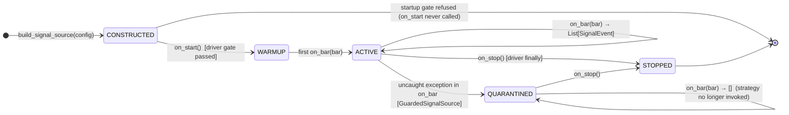
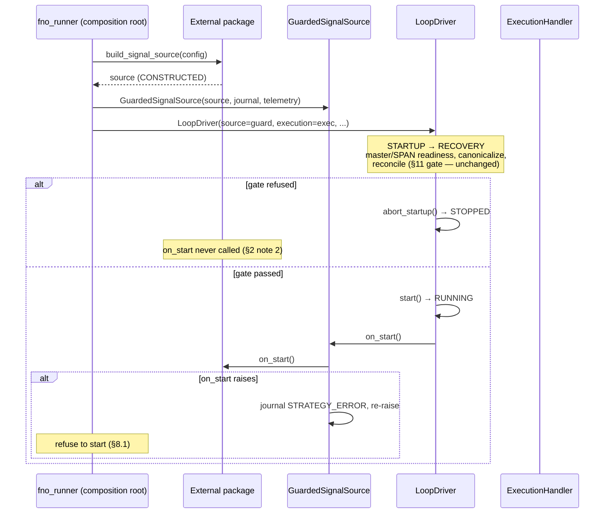
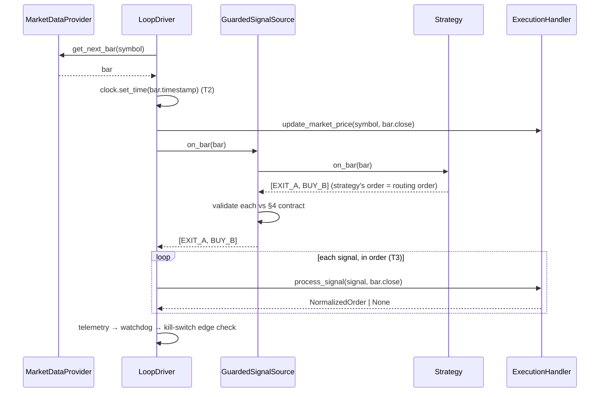
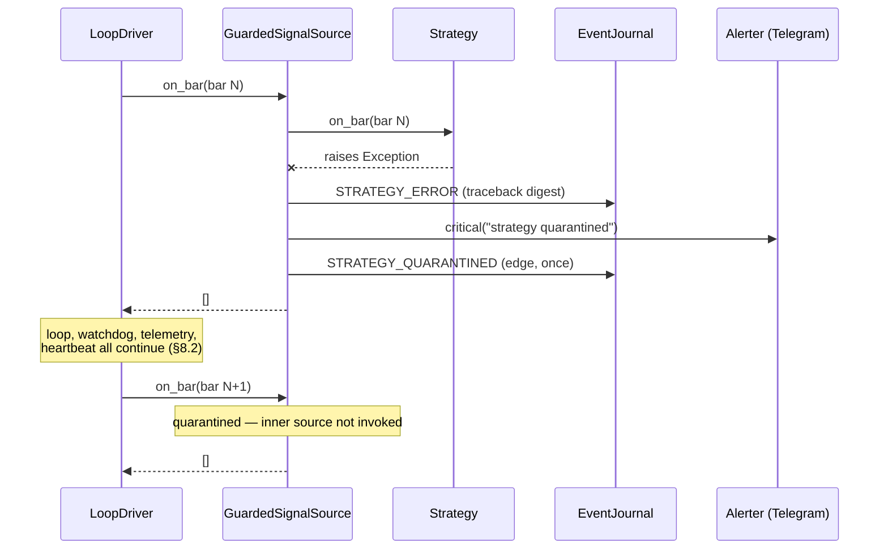

# MM12.1 — Strategy Integration Architecture

**Date:** 2026-07-02
**Status:** APPROVED (Technical Lead, 2026-07-02 — no changes requested; one non-blocking note
recorded against ADR-019, see §8.2 and §12). Architecture only — no implementation authored under
this document.
**Author role:** System Architect
**Milestone:** MM12 — External Strategy Integration Contract (seeded by ADR-014 from
`MM11_ARCHITECTURE_REVIEW_AND_PROPOSAL.md` Part 2, content carried forward unchanged)

---

## 0. Preconditions and scope discipline

### 0.1 ADR-014 precondition — re-verified

ADR-014's Consequences section requires the MM12 kickoff to **re-verify, not assume**, that
`core/runtime/signal_source.py` is still unmodified before treating its stability claim as current.

**Verified 2026-07-02:** `git log --oneline -- core/runtime/signal_source.py` returns exactly one
commit (`c1d833a` — "Add core/runtime seam: SignalSource + DriverConfig"). The seam has never been
modified since introduction. The stability claim holds.

### 0.2 What this document does NOT do

Platform Infrastructure v1.0 is certified (`MM11_7_PLATFORM_V1.0_CERTIFICATION.md`). This
architecture therefore treats the following as **fixed, closed surfaces** and designs only against
their public contracts:

| Fixed surface | Contract source |
|---|---|
| `LoopDriver` lifecycle, tick loop, routing | `core/runtime/driver.py`; `docs/DRIVER_SPECIFICATION.md` §3–§9 |
| `SignalSource` ABC | `core/runtime/signal_source.py` (frozen at `c1d833a`) |
| `SignalEvent` / `OHLCVBar` / `SignalType` | `core/events.py` (frozen dataclasses) |
| `ExecutionHandler.process_signal` | `core/execution/handler.py:524` |
| Risk / margin (`NseMarginEngine`, SPAN, ELM) | ADR-011/012/013 — feature-frozen |
| Persistence, telemetry, journal, broker adapters | MM11.7 certification scope |

**The central architectural stance of MM12:** the platform/strategy boundary already exists and is
already correct — the `SignalSource` seam, the `SignalEvent` contract, and the driver's pull model
(ADR-002, ADR-003, ADR-006, ADR-MM7E-1, Constitution §5). MM12 does not invent a boundary; it
**certifies, hardens, and documents** the existing one. Every deliverable in this design is
*additive scaffolding at the seam* — zero modifications to any frozen component.

### 0.3 New surface introduced by this architecture (complete list)

1. `GuardedSignalSource` — a platform-owned wrapper (itself a `SignalSource`) that enforces the
   signal contract at runtime (§7.3, §8).
2. `SignalSourceConformanceSuite` — an offline certification harness (§7.2).
3. A reference, non-alpha `SignalSource` implementation (§15, MM12.4).
4. New `EventType` members for the runtime journal: `STRATEGY_ERROR`, `STRATEGY_QUARANTINED`,
   `SIGNAL_CONTRACT_REJECTED` (§8).
5. Documentation: the promotion path and go-live checklist (§14, §15).

Nothing else. No plugin registry, no multi-strategy loader, no `Strategy` ABC parallel to
`SignalSource`, no read-model service — each rejected explicitly below with reasons.

---

## 1. The boundary, stated precisely

```
┌────────────────────────────  EXTERNAL (strategy repo)  ───────────────────────────┐
│                                                                                   │
│   Strategy package                                                                │
│   - owns alpha, indicators, its own state, its own config                         │
│   - exports:  build_signal_source(config: dict) -> SignalSource                   │
│   - depends on the platform (imports core.runtime.signal_source, core.events)     │
│   - is NEVER imported by the platform (ADR-002; Constitution §5)                  │
│                                                                                   │
└───────────────┬───────────────────────────────────────────────────────────────────┘
                │  factory call (composition root only — ADR-MM7E-1)
┌───────────────▼───────────────────────  PLATFORM  ─────────────────────────────────┐
│                                                                                    │
│  scripts/fno_runner.py (composition root)                                          │
│      wraps:   GuardedSignalSource(external_source, journal, telemetry)   [MM12]    │
│      injects: LoopDriver(source=guarded, ...)                                      │
│                                                                                    │
│  LoopDriver ──pull──► guarded.on_bar(bar) ──► external.on_bar(bar)                  │
│      │                       │ validate / contain                                  │
│      └──route──► ExecutionHandler.process_signal(signal, bar.close)                │
│                        └─► risk → margin → order → broker → ledger → journal       │
└────────────────────────────────────────────────────────────────────────────────────┘
```

The only artifact that crosses the boundary at runtime is a `List[SignalEvent]`, pulled
synchronously once per bar. The only artifacts that cross at build time are the platform's two
import surfaces (`core.runtime.signal_source`, `core.events`) and the strategy's one factory
export. Everything else in both directions is forbidden.

---

## 2. Strategy lifecycle

The strategy has **no lifecycle of its own** — it observes the platform's. The driver owns the
state machine (DRIVER_SPECIFICATION §3); the strategy receives exactly three lifecycle
notifications, all already present on the frozen ABC:

| Strategy phase | Trigger | Platform state | Strategy may | Strategy must not |
|---|---|---|---|---|
| **CONSTRUCTED** | factory call at composition root | pre-STARTUP | load its own model/config files, allocate state | touch network*, emit signals, assume market data exists |
| **WARMUP** | `on_start(context=None)` — once, after the startup gate passes, before the first bar | RUNNING (gate passed) | build indicator warmup from its own data access, seed RNG, open its own files | receive or expect ledger/broker/handler access (§5.4) |
| **ACTIVE** | `on_bar(bar)` — once per bar, per configured symbol, in fixed symbol order | RUNNING or PAUSED | compute, update internal state, return signals | mutate platform state, block unboundedly, call back into the driver |
| **STOPPED** | `on_stop()` — once, on every exit path (driver `finally`) | STOPPING→STOPPED | flush/close its own resources | assume it will be called before process death (crash-kill is possible) |

\* network access during CONSTRUCTED/WARMUP is a strategy-internal concern (e.g., loading a model
artifact); during ACTIVE it is forbidden on the `on_bar` path (§6).

### 2.1 Lifecycle diagram



Three properties worth naming:

1. **The strategy never sees PAUSED.** The driver keeps pulling bars while PAUSED (routing is
   suspended, collection is not — `driver.py:_dispatch_signals`). The strategy cannot distinguish
   PAUSED from RUNNING and must not try: its signals during PAUSED are counted and dropped by the
   driver. This is deliberate — a strategy that behaves differently when unobserved is
   non-deterministic by construction.
2. **`on_start` is only called on a passed startup gate.** If master/SPAN readiness or
   reconciliation refuses the start, the strategy is constructed but never started — it must
   tolerate construction-then-abandonment with no cleanup call.
3. **QUARANTINED is platform-imposed, not a strategy state.** It lives in the
   `GuardedSignalSource` wrapper (§8), invisible to the frozen driver, which continues to see a
   well-behaved source returning `[]`.

---

## 3. Strategy interface

### 3.1 Decision: `SignalSource` IS the strategy interface

No new `Strategy` ABC, no additional hooks (`on_fill`, `on_reject`, `on_pause`), no richer
callback surface. Rationale:

- The ABC has survived MM7–MM11 unmodified while the entire execution stack was built against it —
  the strongest empirical evidence available that it is sufficient.
- Every proposed additional hook is a feedback channel from platform to strategy, and every
  feedback channel is a determinism hazard (the strategy's output would become a function of
  execution outcomes, which differ between PAPER and LIVE by construction — broker latency,
  rejections, partial states). The current design keeps the strategy a pure function of market
  data (§6), which is what makes external backtesting valid evidence for promotion (§14).
- Adding hooks would require touching the frozen driver. Out of scope by v1.0 certification.

The consequence — strategies cannot observe their own fills — is handled by the shadow-state model
(§3.3), and the residual risk is fail-safe (§3.4).

### 3.2 Packaging and construction convention

- An external strategy is a **separate repository/package** that imports the platform
  (`Strategy → Platform`, never the reverse — Constitution §5).
- It must export a single factory: `build_signal_source(config: dict) -> SignalSource`.
  The factory signature is deliberately loose (a dict, not a typed config class) — the platform
  does not own or validate strategy configuration (§9); it only owns what comes back: a
  `SignalSource` that passes conformance.
- The composition root (`scripts/fno_runner.py`) **injects, never constructs** the source
  (ADR-MM7E-1). MM12 adds one composition step: the root wraps the injected source in
  `GuardedSignalSource` before handing it to the driver. Frozen driver code is unaffected — it
  receives a `SignalSource` as always.
- **One strategy process = one strategy.** Multi-strategy composition (a fan-in source multiplexing
  several strategies) is explicitly deferred until a second real strategy exists — building a
  registry/loader now would repeat the rejected `MarginProvider` mistake (premature abstraction,
  ADR-013 reasoning; MM11 review §2.6).

### 3.3 Strategy state model — shadow state

The strategy derives all of its state from exactly two inputs:

1. the bar stream it receives (`on_bar`), and
2. the signals it has itself emitted.

It maintains its own *shadow* of position state ("I emitted BUY on X, so I am long X") without
ever reading the ledger. This is the only state model compatible with §5.4 (no ledger/broker/
handler handle) and with determinism (§6): `state = f(bar_history, own_signal_history, config)`.

### 3.4 Divergence analysis — why shadow state is fail-safe

Shadow state can diverge from ledger truth in exactly one direction: **the strategy believes a
position exists that does not** (its entry signal was rejected by the kill switch, the margin
gate, the risk gate, the Greek gate, the stacking guard, or the priceability gate — all of which
return `None` without feedback). The reverse direction is impossible: the platform never opens a
position the strategy did not signal.

Every consequence of that one-directional divergence is absorbed by existing handler guards:

| Strategy belief | Ledger truth | Strategy action | Platform outcome |
|---|---|---|---|
| long X (entry was rejected) | flat X | emits EXIT X later | `process_signal` returns `None` on FLAT (`handler.py:699-701`) — harmless no-op |
| long X (entry was rejected) | flat X | emits another BUY X | processed as a fresh entry on its own merits |
| long X (entry filled) | long X | emits BUY X again (bug) | stacking guard blocks it (`handler.py:633-636`) |
| duplicate signal replay | — | re-emits same `signal_id` | idempotency lock rejects (`handler.py:550-554`) |

Divergence is therefore *fail-safe, not fail-correct*: the strategy may waste signals, but no
guard-bypassing or position-doubling path exists. This is accepted explicitly rather than fixed
with a feedback channel.

**Deferred (recorded, not built):** a read-only position projection handed via the existing
`on_start(context=...)` parameter — the one place the frozen contract already permits the driver
to pass something in. If the first real strategy demonstrates a concrete need (e.g., recovering
its shadow state after a process restart while positions are open), that is the designated
extension point, and it requires no ABC change. Until then it is not built (CLAUDE.md: no
abstractions ahead of a concrete need).

---

## 4. Signal contract

### 4.1 The event

`SignalEvent` (`core/events.py:73`, frozen dataclass) is the complete vocabulary of strategy
intent:

| Field | Type | Contract |
|---|---|---|
| `strategy_id` | `str` | **Required.** Stable identifier of the emitting strategy + version (e.g. `"meanrev_v2"`). Used in journal/audit and in the derived signal id. Must be constant for a deployed strategy build. |
| `symbol` | `str` | **Required.** Platform-canonical symbol (`NSE_EQ\|INE...`, `NSE_INDEX\|Nifty 50`, futures/options canonical forms). Must be inside the configured driver universe (`DriverConfig.symbols`) or resolvable from it (option entries name the underlying; the `OptionsContractSelector` picks the contract — `handler.py:654`). |
| `timestamp` | `datetime` | **Required.** MUST equal the triggering `bar.timestamp`. Wall-clock timestamps are a determinism violation (§6) and break idempotency-id stability. |
| `signal_type` | `SignalType` | `BUY` / `SELL` / `EXIT`. `NEUTRAL` is reserved for non-routing diagnostics and SHOULD NOT be emitted by external strategies (it consumes an idempotency slot for no effect). |
| `confidence` | `float` | `[0, 1]`. Audit/analytics only — the platform never sizes or gates on it. |
| `metadata` | `Dict[str, Any]` | See §4.2 — the contract's load-bearing surface. |
| `context` | `Optional[TradeStructuralContext]` | Optional audit snapshot (Audit-First principle). Strategy-owned content; journaled verbatim. |

### 4.2 Metadata key ownership

The `metadata` dict is a shared namespace; MM12 formalizes who owns which keys:

**Platform-reserved keys (contract v1.0)** — meanings fixed by the platform; a strategy supplying
them must honor these semantics:

| Key | Required? | Semantics |
|---|---|---|
| `sl_distance` | **MANDATORY on BUY/SELL** (not EXIT) | Absolute price distance to the stop. Consumed by sizing/risk (`handler.py:556`). |
| `risk_r` | **MANDATORY on BUY/SELL** (not EXIT) | Risk unit in rupees for sizing and fee-impact calculation. |
| `signal_id` | Recommended | Explicit idempotency key. If absent, the handler derives `sha256(symbol_strategyid_timestamp)` (`handler.py:546-548`) — sufficient iff the strategy never emits two same-type signals for the same symbol in the same bar. |
| `quantity` | Optional | Explicit size override; bypasses risk-based sizing. Certified strategies SHOULD NOT use it (it moves sizing authority across the boundary — Principle: Execution Owns Reality). |
| `execution_mode` | Optional | `"option"` routes entries through `OptionsContractSelector` (`handler.py:654`). |

**Strategy-owned keys** — everything else. The platform journals them verbatim and never reads
them. Strategies SHOULD namespace-prefix private keys (`"myalgo_*"`) so future platform-reserved
keys can be added without collision (§14.3, additive-only evolution).

### 4.3 Strict validation replaces default-filling (boundary hardening)

Today `process_signal` reacts to a missing `sl_distance`/`risk_r` on a real broker by logging a
WARNING and **default-filling** conservative values (`handler.py:575-581`). That is a legacy
tolerance, acceptable when every caller was in-repo. It is the wrong posture for an external
contract: a certified strategy that forgets its risk definition has a defect, and silently trading
it with synthetic risk numbers violates Audit-First (the trade is no longer explainable by the
strategy's facts).

**Decision:** the `GuardedSignalSource` wrapper (§7.3) validates mandatory metadata **before the
driver routes**, and **rejects-and-journals** (`SIGNAL_CONTRACT_REJECTED`) instead of defaulting.
The handler's legacy default path is left untouched (frozen component; still serves internal/mock
flows) but becomes unreachable for guarded external sources — the wrapper guarantees no
contract-violating signal ever reaches `process_signal`.

### 4.4 Ordering

The returned list order **is** the routing order (driver never re-ranks — `signal_source.py:44`,
`driver.py:_dispatch_signals`). The strategy owns prioritization; the required convention for
contract v1.0: **EXITs before entries** within a bar, so freed margin/stacking capacity is
available to same-bar entries.

---

## 5. Timing guarantees

### 5.1 What the platform guarantees to the strategy

| # | Guarantee | Source |
|---|---|---|
| T1 | `on_bar` is called **synchronously, on the driver thread, once per bar per symbol, in fixed configured symbol order**. Never concurrently, never reentrantly. | ADR-003; `driver.py:_tick` |
| T2 | The deterministic Clock is advanced to `bar.timestamp` **before** `on_bar` is called. Platform time never runs ahead of or behind the bar being processed. | `driver.py:662` |
| T3 | Signals returned from `on_bar(bar)` are routed **in the same tick**, before the next bar is pulled, each as `process_signal(signal, current_price=bar.close)`. No queuing across bars, no batching, no driver-side pricing. | `driver.py:676,722` |
| T4 | `on_start` completes before the first `on_bar`; `on_stop` is called exactly once on every orderly exit path. | `driver.py:605-606,634-636` |
| T5 | Bar delivery order within a symbol is monotonically non-decreasing in timestamp (provider contract). | DRIVER_SPECIFICATION §7 |

The platform does **not** guarantee: gapless bars (feed outages are the watchdog's problem, not
papered over), a callback on fill/reject (§3.1), or that a returned signal results in an order
(six rejection gates may drop it silently from the strategy's perspective).

### 5.2 What the strategy guarantees to the platform

| # | Obligation | Enforcement |
|---|---|---|
| S1 | `on_bar` returns in **bounded, small time** — budget: well under `DriverConfig.poll_interval_s`, target < 100 ms typical. The loop is single-threaded; a slow strategy delays its own routing, the watchdog drive, and telemetry for every symbol. | Conformance suite (latency assertion); live watchdog staleness catches pathological stalls indirectly |
| S2 | No blocking I/O (network, broker APIs, interactive) on the `on_bar` path. Local reads of the strategy's own precomputed facts (Analytics-Produce-Facts principle) are permitted and are the intended pattern. | Conformance suite + code review at certification |
| S3 | No threads that touch platform objects. Internal threads are permitted only behind a queue drained synchronously in `on_bar` (the discretionary pattern, `signal_source.py:52-55`). | Conformance suite (behavioral) + review |
| S4 | Never calls back into driver/handler/ledger/broker. | §5.4 of the seam docstring; conformance static check |

---

## 6. Determinism guarantees

The platform's side is already law (ADR-003): single thread, data-driven clock, fixed ordering,
identical code path live and replay. MM12 extends the requirement across the boundary:

**A certified strategy must be replay-equivalent:** given the identical bar sequence and identical
configuration, it must emit the byte-identical signal sequence (same fields, same metadata, same
order), on every run, on any machine.

Concretely forbidden inside the strategy's decision path:

| Forbidden | Why | Permitted alternative |
|---|---|---|
| `datetime.now()` / wall-clock | diverges between live and replay | `bar.timestamp` is the only time |
| Unseeded randomness | run-to-run divergence | fixed-seed RNG, seed in config |
| Network calls in `on_bar` | latency + payload nondeterminism | precomputed facts loaded at `on_start` |
| Reading mutable shared state (files being written, live DBs) mid-run | order-dependent results | immutable snapshots resolved at `on_start` |
| Dict-ordering / set-iteration dependence on unordered collections | Python hash randomization | explicit sort keys |
| Behavior conditioned on execution outcomes | fills/rejects differ PAPER vs LIVE | shadow state (§3.3) |
| Float accumulation dependent on symbol arrival interleaving | cross-symbol ordering is fixed but feed gaps are not | per-symbol state isolation |

**Why this is a hard requirement, not hygiene:** the promotion path (§14) accepts an *external*
backtest as evidence. That evidence is only valid if the strategy is a deterministic function of
bars — otherwise the PAPER run validates a different program than the one that was backtested.
Replay-equivalence is what makes the whole promotion model sound.

**Verification is mechanical (§7.2):** run the source twice over the same recorded bar sequence;
assert the emitted signal streams are identical. This "replay-twice" check is the conformance
suite's core determinism assertion.

---

## 7. Validation requirements — three layers

```
Layer 1: STATIC       — conformance suite, offline, pre-certification
Layer 2: BEHAVIORAL   — conformance suite, offline, pre-certification
Layer 3: RUNTIME      — GuardedSignalSource, every bar, in production
```

### 7.1 Layer 1 — static conformance

Runnable against the strategy package without executing a bar:

- Implements `SignalSource`; `on_bar` is not a coroutine; no overriding of driver-facing behavior
  beyond the three hooks.
- Import graph check: the strategy package imports no platform module beyond the sanctioned
  surface (`core.runtime.signal_source`, `core.events`). In particular: no
  `core.execution.*`, `core.brokers.*`, `core.risk.*` imports.
- Constructor inspection: no `ExecutionHandler`/ledger/broker-typed parameter accepted anywhere.

### 7.2 Layer 2 — behavioral conformance (`SignalSourceConformanceSuite`)

A pytest-importable harness (shape decision from the MM11 review §2.7, MM11.1 item — now MM12.2)
that drives the candidate source through a recorded bar corpus and asserts:

| Check | Assertion |
|---|---|
| Return shape | every `on_bar` returns `List[SignalEvent]`; never `None`; elements are `SignalEvent` |
| No platform mutation | driving the source against a sentinel/instrumented environment produces zero side effects on platform state |
| Lifecycle | tolerates `on_start`→`on_stop` with zero bars; tolerates construction without `on_start` (abandoned startup, §2 note 2); `on_stop` idempotent-safe |
| Non-reentrancy | no call back into the driver during `on_bar` (sentinel driver handle) |
| **Determinism** | replay-twice over the corpus ⇒ byte-identical signal streams (§6) |
| Timestamp discipline | every `signal.timestamp == bar.timestamp` of the triggering bar |
| Metadata contract | every BUY/SELL carries numeric `sl_distance > 0`, `risk_r > 0` |
| Latency budget | p99 `on_bar` wall time under the declared budget (S1) |
| PAUSED-blindness | signal stream unchanged when the harness simulates collected-but-unrouted stretches |

Passing Layer 1+2 = **CONFORMANT** — the first gate of the promotion path (§14).

### 7.3 Layer 3 — runtime boundary guard (`GuardedSignalSource`)

A platform-owned `SignalSource` decorator, composed at the root:

```
driver ── on_bar(bar) ──► GuardedSignalSource
                              │ 1. if quarantined: return []
                              │ 2. result = inner.on_bar(bar)      (fault boundary, §8)
                              │ 3. validate shape + per-signal contract (§4)
                              │ 4. drop violators → journal SIGNAL_CONTRACT_REJECTED
                              ▼
                          List[SignalEvent]  (only contract-clean signals)
```

Properties:

- It is itself a conforming `SignalSource` — the frozen driver cannot tell the difference, so no
  driver change is needed and §5.4 is preserved (the guard holds journal + telemetry handles,
  which are observation surfaces, not the forbidden ledger/broker/handler).
- Validation is per-signal: one bad signal is dropped and journaled; clean signals in the same
  list still route (mirrors the driver's own §8.4 per-signal isolation philosophy).
- It is the *only* new runtime component between strategy and driver. It adds no strategy
  knowledge, no alpha, no state beyond the quarantine latch and counters.

---

## 8. Error handling

### 8.1 Fault matrix

| Fault | Detection point | Policy | Rationale |
|---|---|---|---|
| Factory raises at construction | composition root | **Refuse to start** — process exits before driver construction | Nothing has started; cleanest possible failure |
| `on_start` raises | driver startup (post-gate) | **Refuse to start** — guard re-raises; the root aborts | Mirrors the startup-gate philosophy (§11): never begin trading in a half-initialized configuration |
| `on_bar` raises | `GuardedSignalSource` | **Quarantine-and-continue** (§8.2) | See below — the load-bearing decision |
| `on_bar` returns malformed value (non-list, wrong element type) | guard, per call | treat as a fault ⇒ same as raise (quarantine) | A source that violates the return shape is defective, not merely noisy |
| Individual signal violates §4 contract | guard, per signal | **Drop + journal `SIGNAL_CONTRACT_REJECTED`**; other signals proceed; N violations do NOT escalate to quarantine in v1.0 | Contract violations are data defects; exceptions are program defects — different severities |
| Signal rejected downstream (risk/margin/Greek/stacking/kill-switch) | handler | existing behavior — `None`, no strategy feedback | Not a fault; the system working as designed (§3.4) |
| `process_signal` raises | driver §8.4 | existing behavior — `BROKER_ERROR`, loop survives | Frozen, already correct |
| `on_stop` raises | guard | log + swallow; shutdown proceeds | Shutdown must complete (mirrors telemetry-close handling, `driver.py:638-642`) |

### 8.2 The quarantine decision (`on_bar` fault policy)

Today an `on_bar` exception propagates out of `_tick()` into `run()`'s `while`, and the `finally`
block performs a clean STOPPING→STOPPED shutdown — i.e., **a strategy bug currently stops the
whole process.** That is the wrong failure mode for LIVE: the process dies with positions open,
taking telemetry, the watchdog, heartbeats, and the operator's observability down with it —
exactly when they are most needed (Constitution §6: failures must be observable without broker
login).

**Decision — quarantine-and-continue:** on the first uncaught `on_bar` exception, the guard:

1. journals `STRATEGY_ERROR` (durable, with traceback digest and `strategy_id`),
2. fires `alerter.critical(...)` (the existing Telegram/ops path),
3. latches QUARANTINED and journals `STRATEGY_QUARANTINED` (edge-triggered, once),
4. returns `[]` for this and every subsequent bar — the inner source is never invoked again.

The loop, watchdog, telemetry, heartbeat, and journal all keep running. The account state freezes
(no new entries — no signals exist to route) and the operator intervenes with full observability.
This deliberately mirrors the platform's existing severe-fault idiom: *kill-switched-but-running*
(DRIVER_SPECIFICATION §3.2 note; the watchdog stale-data pattern) — degrade trading, never
degrade observability.

**No automatic retry, by design:** a deterministic strategy (§6) that threw on bar *N* will throw
on bar *N* again; retrying is either futile or — worse — proof the strategy is nondeterministic.
Quarantine is terminal for the process lifetime; recovery is operator restart after a fix.

**Named residual, accepted:** in quarantine, open positions are unmanaged by the strategy (its
exit logic is dead). This equals the existing kill-switch posture (`handler.py:606` — the kill
switch also blocks everything including EXITs, and does not auto-flatten), so MM12 introduces no
*new* class of risk. Auto-flattening on quarantine was considered and rejected: closing positions
is a trading decision, and taking it autonomously inside an error handler violates "the platform
holds no alpha" — the alert-and-operator loop is the correct authority. Optionally, the root MAY
additionally wire quarantine to `activate_kill_switch` (belt-and-braces); that is an
implementation choice for MM12.3, not required by this architecture since `[]`-forever already
stops all strategy-driven trading.

**Non-blocking note (Technical Lead, 2026-07-02, recorded for ADR-019):** the guard deliberately
combines two concerns in one component — *contract validation* (per-signal drop, §7.3) and
*operational fault policy* (quarantine, this section). This coupling is by design: with exactly
one fault policy in existence, extracting a separate policy object would be speculative
abstraction (§13). Extraction is deferred until there is evidence of a **second** policy (e.g., a
future PAPER-only "log-and-keep-invoking" diagnostic mode, or per-strategy policy selection under
multi-strategy composition, §16.1). ADR-019 must carry this acknowledgment verbatim when authored.

### 8.3 New journal vocabulary

Three additions to `EventType` (`core/runtime/event_journal.py`) — additive, non-breaking:

| Event | Severity | Emitted by | When |
|---|---|---|---|
| `STRATEGY_ERROR` | ERROR | guard | uncaught `on_bar`/`on_start` exception (with traceback digest) |
| `STRATEGY_QUARANTINED` | CRITICAL | guard | quarantine latch set (edge-triggered, once) |
| `SIGNAL_CONTRACT_REJECTED` | WARNING | guard | per dropped contract-violating signal (with reason + signal identity) |

Telemetry counters mirror these (`RuntimeMetric` additions), keeping the "observable without
broker login" surface complete for the new failure class.

---

## 9. Metadata and configuration ownership

| Artifact | Owner | Notes |
|---|---|---|
| `SignalEvent` schema (fields, types) | **Platform** | frozen dataclass; changes require a platform ADR |
| Platform-reserved metadata keys (§4.2) | **Platform** | additive-only evolution; reserved list is contract-versioned |
| All other metadata keys | **Strategy** | journaled verbatim, never interpreted; prefix convention |
| `TradeStructuralContext` content | **Strategy** | audit payload; platform stores, never reads for decisions |
| `strategy_id` value + versioning discipline | **Strategy** | must change when strategy logic changes (it keys the audit trail) |
| Strategy config (`build_signal_source(config)`) | **Strategy** | platform passes it through opaque; NOT part of `DriverConfig` |
| `DriverConfig` (symbols, mode, intervals) | **Platform** | the strategy universe ⊆ driver universe is an operator/root responsibility, checked at composition |
| Journal, ledger, telemetry records | **Platform** | strategy has no read or write access |
| Conformance corpus + certification record | **Platform** | the platform repo owns the harness and the recorded evidence of who passed it |

---

## 10. Responsibility split (consolidated)

### 10.1 Platform responsibilities

1. Pull bars deterministically; advance the clock before strategy invocation (T1–T2).
2. Route returned signals same-bar, in order, at `bar.close`, through the single trade path
   (`process_signal`) — ADR-006.
3. Own **all** of: risk gating, margin (NseMarginEngine), sizing, order construction, broker
   interaction, fills, position/ledger truth, recovery, reconciliation, kill switch.
4. Journal every lifecycle and boundary event durably; expose telemetry/health/heartbeat.
5. Enforce the signal contract at the boundary (guard) and never let a malformed signal reach
   execution.
6. Contain strategy faults without losing observability (quarantine).
7. Keep the boundary stable: additive-only contract evolution, versioned (§14.3).

### 10.2 Strategy responsibilities

1. Implement `SignalSource` exactly; export the factory; pass conformance before any PAPER run.
2. Emit complete, contract-clean signals (mandatory risk metadata on entries; bar-timestamped;
   EXIT-before-entry ordering).
3. Be replay-equivalent (§6) — deterministic in bars + config, seeded, I/O-free on the bar path.
4. Maintain its own shadow state; tolerate silent rejection (never assume a signal became a
   position); never require feedback.
5. Respect the compute budget (S1) and threading rules (S3).
6. Own its alpha, research, backtesting, and configuration entirely outside this repository
   (Constitution §4 non-responsibilities; ADR-002).
7. Version `strategy_id` honestly — the audit trail's explanatory power depends on it.

---

## 11. Sequence diagrams

### 11.1 Startup and warmup



### 11.2 Per-bar happy path



### 11.3 Contract-violating signal (drop, not default)

```mermaid
sequenceDiagram
    participant Drv as LoopDriver
    participant Guard as GuardedSignalSource
    participant Strat as Strategy
    participant Jrn as EventJournal

    Drv->>Guard: on_bar(bar)
    Guard->>Strat: on_bar(bar)
    Strat-->>Guard: [BUY_X (no sl_distance), EXIT_Y]
    Guard->>Jrn: SIGNAL_CONTRACT_REJECTED (BUY_X, reason=missing sl_distance)
    Guard-->>Drv: [EXIT_Y]
    Note over Drv: only the clean signal routes;<br/>handler's legacy default-fill never engages (§4.3)
```

### 11.4 Strategy fault → quarantine



---

## 12. ADR recommendations

Four decisions in this document are ADR-grade. Recommended for authoring at MM12.2 kickoff
(numbering continues from ADR-015):

| Proposed | Title | Decision captured |
|---|---|---|
| **ADR-016** | `SignalSource` Is The Strategy Interface; External Packaging Via Factory | No new `Strategy` ABC, no additional hooks, no feedback channels; external repo exports `build_signal_source(config) -> SignalSource`; composition root wraps-then-injects. Alternatives to record: richer `Strategy` ABC with `on_fill` (rejected — determinism hazard + frozen-driver change); in-repo strategy directory (rejected — ADR-002). |
| **ADR-017** | Strategy State Is Shadow State; Divergence Is Fail-Safe | State = f(bars, own signals, config); no ledger access; one-directional divergence absorbed by existing handler guards (§3.4). Named extension point: read-only projection via `on_start(context)`, gated on a demonstrated need from the first real strategy. |
| **ADR-018** | Boundary Validation Is Reject-And-Journal, Enforced By A Platform-Owned Guard | `GuardedSignalSource` at the composition root; strict per-signal contract validation; drop + `SIGNAL_CONTRACT_REJECTED`, never default-fill; frozen driver/handler untouched. Alternative to record: harden `process_signal` itself (rejected — modifies a frozen v1.0 component; wrong layer for a boundary concern). |
| **ADR-019** | Strategy Fault Policy: Quarantine-And-Continue | First uncaught `on_bar` fault ⇒ journal + critical alert + permanent `[]`; loop and observability survive; no auto-retry; no auto-flatten; `on_start` faults refuse to start. Alternative to record: fail-fast process stop (rejected — kills observability with positions open, Constitution §6). **Must include the Technical Lead's non-blocking note (§8.2):** the guard combines contract validation and operational fault policy in one component by design; extraction of a separate policy object is deferred until evidence of a second policy exists. |

---

## 13. Rejected alternatives (summary register)

| Alternative | Rejected because |
|---|---|
| New `Strategy` ABC with fill/reject callbacks | Feedback channels break replay-equivalence; requires frozen-driver changes; the seam has proven sufficient (ADR-016) |
| Plugin registry / multi-strategy loader | No second strategy exists; identical shape to the rejected `MarginProvider` premature abstraction (ADR-013 reasoning, MM11 review §2.6) |
| Handler-side strict validation | Modifies a frozen, certified component; boundary concerns belong at the boundary layer |
| Default-filling missing risk metadata for external sources | Violates Audit-First — trades no longer explainable by the strategy's facts (§4.3) |
| Auto-retry after `on_bar` fault | Deterministic strategy ⇒ same fault; success-on-retry would prove nondeterminism (§8.2) |
| Auto-flatten on quarantine | A trading decision inside an error handler — platform must hold no alpha (§8.2) |
| Fail-fast process stop on strategy fault | Destroys observability exactly when needed; quarantine preserves Constitution §6 (ADR-019) |
| Read-only ledger projection now | No demonstrated consumer need yet; extension point reserved at `on_start(context)` (ADR-017) |

---

## 14. Migration path

There is no legacy strategy to migrate (Production Strategy Status: greenfield; NiftyShield /
PixityAI were never ported — SALVAGE 2026-06-04). "Migration" here means two things:

### 14.1 Adoption path for a strategy (the promotion ladder)

```
 EXTERNAL BACKTEST ──► CONFORMANT ──► PAPER-VALIDATED ──► LIVE-APPROVED
 (strategy repo,       (passes Layers  (N sessions in      (go-live checklist:
  strategy-owned        1+2, evidence   ExecutionMode.PAPER  ops sign-off, funded
  evidence)             recorded)       through fno_runner;  account, credential
                                        journal audit clean; lifecycle, first
                                        shadow-state         authenticated
                                        divergence reviewed) position capture)
```

Each gate's concrete requirements, evidence format, and sign-off authority are the MM12.5
promotion-path document's content. Two rules are architectural and fixed here:

- **No strategy reaches PAPER without CONFORMANT** — the guard assumes contract-clean-by-
  construction sources; conformance is what earns that assumption.
- **LIVE-APPROVED is revoked by any contract-relevant change** — a new `strategy_id` (which any
  logic change requires, §9) restarts the ladder at CONFORMANT. Re-certification is cheap
  (automated suite); skipping it is how silent regressions reach capital.

### 14.2 Historical-design ports

A port of a prior-codebase design (e.g., a NiftyShield-style system) is architecturally identical
to a brand-new external strategy: new repo, factory export, full ladder. No shortcut exists or
should — the prior code predates the canonical instrument model, the margin engine, and this
contract.

### 14.3 Contract evolution

- The contract is versioned: `STRATEGY_CONTRACT_VERSION = "1.0"` published with the conformance
  suite; a certified strategy records which version it passed.
- Evolution is **additive-only** within a major version: new *optional* reserved metadata keys,
  new conformance checks (grandfathering rule stated per change). Removing/retyping a field,
  changing mandatory keys, or changing timing semantics is a major-version change requiring a new
  ADR and re-certification of every strategy.
- The frozen `SignalSource` ABC and `SignalEvent` dataclass are the contract's stability anchor —
  ADR-014's verification discipline (re-check the seam's git history at each milestone that
  depends on its stability) is adopted as a standing MM12+ practice.

---

## 15. Implementation roadmap (design-level; no code under MM12.1)

Renumbered from the MM11 review §2.7 roadmap (content carried, now MM12.x), extended with the
boundary-guard slice this architecture introduces:

| Slice | Deliverable | Depends on | Exit criterion |
|---|---|---|---|
| **MM12.1** | This architecture + ADR-016..019 authored | — | Technical Lead approval of this document and the four ADRs |
| **MM12.2** | `SignalSourceConformanceSuite` (Layers 1+2, §7.1–7.2): every §5.4 invariant + §6 replay-twice as runnable assertions; pytest-importable shape | MM12.1 | Suite runs against a deliberately-broken fixture source and fails on each violated invariant; runs against the trivial inert source and passes |
| **MM12.3** | `GuardedSignalSource` + `EventType`/`RuntimeMetric` additions (§7.3, §8) | MM12.1 | Guard passes the conformance suite itself (it is a `SignalSource`); fault-injection tests prove quarantine, per-signal drop, and journal vocabulary; zero diffs in `core/runtime/driver.py`, `core/execution/handler.py` |
| **MM12.4** | Reference non-alpha `SignalSource` (inert + queue-backed discretionary example) + **end-to-end PAPER proof**: the real composition root (`fno_runner.py`) drives the guarded reference source through a full session | MM12.2, MM12.3 | The ADR-014 "named cost" is closed: first proof the MM7–MM10 stack drives a `SignalSource` through the real root outside test doubles; journal shows the complete data→signal→execution path |
| **MM12.5** | Promotion-path document + go-live checklist + ops co-component (credential/token lifecycle, process supervision) — may split into MM12.5a/b if credential automation proves nontrivial (MM11 review §2.6 risk, carried) | MM12.4 | Checklist explicitly separates architectural completion from the funded-account operational prerequisite |

MM13 (First External Strategy Validation, PAPER) and MM14 (LIVE readiness + broker margin
reconciliation per ADR-013) remain as sequenced by PROJECT_STATE Planned #9 — unchanged by this
document.

---

## 16. Open questions deliberately left open

1. **Multi-strategy composition** — deferred until a second real strategy exists; the fan-in
   source, if ever needed, composes *outside* the guard (one guard per strategy) so quarantine
   stays per-strategy.
2. **Read-only position projection at `on_start(context)`** — reserved extension point (ADR-017);
   design it only against the first real strategy's restart-recovery need.
3. **Escalating contract-violation counts to quarantine** — v1.0 treats data defects and program
   defects as different severities (§8.1); revisit with evidence from MM13 PAPER journals.
4. **Kill-switch wiring on quarantine (belt-and-braces)** — root-level implementation choice at
   MM12.3; architecture is complete without it.

---

*Ref: ADR-002, ADR-003, ADR-006, ADR-013, ADR-014, ADR-MM7E-1; docs/DRIVER_SPECIFICATION.md §3–§9;
docs/PLATFORM_CONSTITUTION.md §5–§7; docs/reports/MM11_ARCHITECTURE_REVIEW_AND_PROPOSAL.md Part 2/3;
docs/reports/MM11_7_PLATFORM_V1.0_CERTIFICATION.md; core/runtime/signal_source.py (c1d833a);
core/events.py; core/execution/handler.py process_signal intake.*
